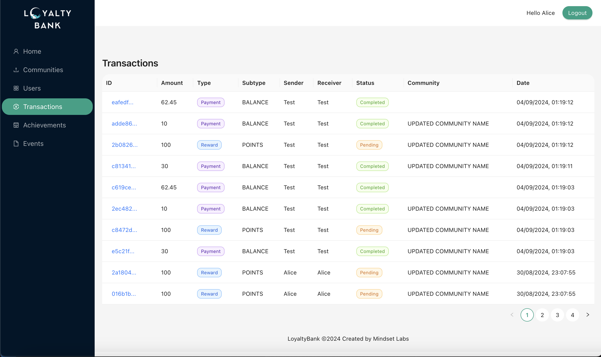

# 🌟 LoyaltyBank

## 🌟 Introduction

LoyaltyBank is a modern, scalable and exciting way to reward your customers. With a simple and easy-to-use API, you can integrate rewards into your application and delight your users with points, discounts, and more!

The API provides a comprehensive set of endpoints that allow you to:

1. Create and manage communities
2. Handle user memberships (with tiers) and roles within communities
3. Issue and track points for users
4. Manage wallet balances
5. Log and retrieve detailed transaction histories
6. Set up and trigger achievements and rewards
7. Implement event logging for user actions

LoyaltyBank also includes the ability to have wallet balances and log transactions which can support a fully functional points system, among other use cases. Whether you're building a loyalty program, gamification features, or a complex rewards ecosystem, LoyaltyBank's API offers the flexibility and functionality to bring your vision to life.

Best of all, it's open source and free!

## 💻 The Stack

LoyaltyBank is built using the following technologies:

- **API**: Node (Typescript), Express, Postgres, Prisma, Redis
- **Admin UI**: React (Typescript), Ant Design, Redux

## 💡 Motivation

LoyaltyBank was born from the recognition that rewards systems are powerful tools for user engagement and loyalty, yet often remain out of reach for many businesses due to the complexity and resources required to build them from scratch.

Our mission is to democratize rewards systems by providing an open-source, feature-rich API that's accessible to developers of all skill levels. With LoyaltyBank, businesses of any size can easily integrate sophisticated rewards mechanisms into their applications without the need for extensive development resources or expertise in rewards system architecture.

Key motivations behind LoyaltyBank include:

1. Simplicity: Offering an intuitive API that allows quick integration of rewards functionality.
2. Flexibility: Supporting various reward structures, from simple points systems to complex, multi-tiered loyalty programs.
3. Scalability: Providing a solution that can grow with your business, from startups to enterprise-level applications.
4. Cost-effectiveness: Eliminating the need for businesses to invest heavily in developing their own rewards systems.
5. Community-driven development: Leveraging the power of open-source to continually improve and expand the platform.

By using LoyaltyBank, developers can focus on creating unique user experiences while we handle the complexities of managing points, transactions, achievements, and more. Whether you're looking to implement a basic points system or a comprehensive loyalty program, LoyaltyBank provides the tools to bring your vision to life efficiently and effectively.

---

## Preview

> Coming soon...

---

## Project Components & Documentation

- [API](./api)
- [Admin UI](./admin-ui)
- Mobile App - coming soon..

